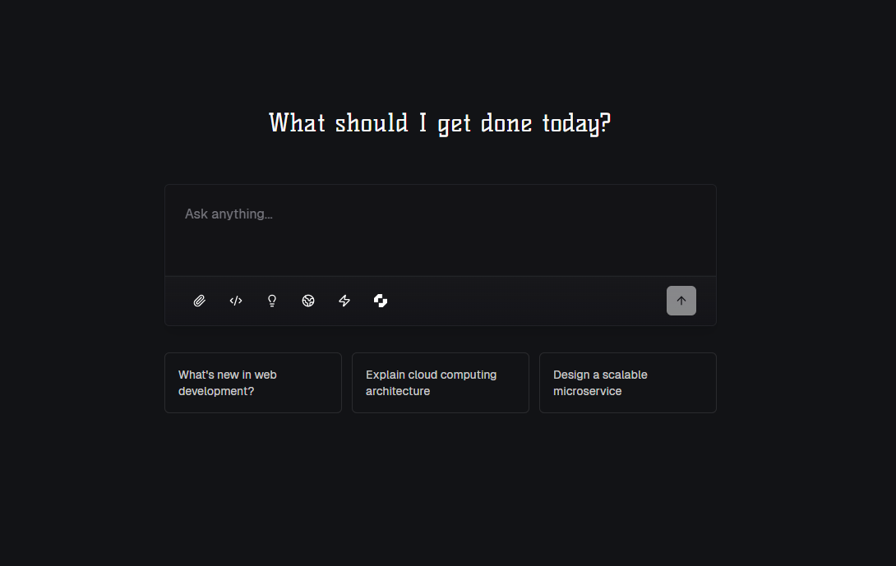

<p align="center">
  
</p>

<div align="center">

# Paradox

A minimalistic AI chat interface that combines the power of Google's Gemini and Perplexity's Sonar APIs to provide intelligent conversations with web search, coding and reasoning capabilities.

<p align="center">
  
</p>

[](https://vercel.com/new/clone?repository-url=https%3A%2F%2Fgithub.com%2Fiamakchavan%2Fparadox)
[](https://sdk.vercel.ai/docs)

</div>

## Features

### AI Integration & Model Support
- **Multi-Model Architecture**
  - Gemini Pro for advanced language processing and image analysis
  - Perplexity integration for real-time web search capabilities
  - DeepSeek R1 for enhanced reasoning and problem-solving
  - Specialized developer mode for technical assistance

### Voice Capabilities
- **ElevenLabs Integration**
  - Real-time voice input processing
  - Natural language voice synthesis
  - Custom voice profile support
  - Dynamic voice agent configuration
  - Real-time connection status monitoring

### UI/UX
- **Modern Interface**
  - Responsive design optimized for all devices
  - Dynamic dark/light theme support
  - Real-time streaming responses with typing indicators
  - Smooth transitions and animations throughout the interface
  - Accessibility-first approach with ARIA support

### Document & Media Processing
- **Image Analysis**
  - Multi-image upload support (up to 20MB per image)
  - Real-time image processing and analysis
  - Drag-and-drop functionality
  - Inline image preview and management

- **Document Handling**
  - PDF document analysis (10MB limit)
  - Multi-document upload capability
  - Inline PDF preview in conversations
  - Context-aware document processing
  - Seamless integration with AI models

### Data Management
- **Export Capabilities**
  - One-click CSV export for tabular data
  - Structured data formatting
  - Automatic number alignment
  - Preserved table structure in exports
  - Clean data presentation

### Search & Analysis
- **Web Integration**
  - Real-time internet search functionality
  - Structured search result presentation
  - Deep web content analysis
  - Source verification and citation

- **Reasoning Engine**
  - Step-by-step thinking process visualization
  - Expandable reasoning breakdown
  - Complex problem decomposition
  - Logical flow visualization

### Developer Tools
- **Technical Features**
  - Syntax-highlighted code blocks
  - Multiple programming language support
  - Code quality analysis
  - Best practices implementation
  - Technical documentation integration
  - Improved code blocks with enhanced formatting
  - Code file download functionality

### System Performance
- **Monitoring & Analytics**
  - Real-time performance tracking
  - Speed Insights integration
  - Response time monitoring
  - System health indicators
  - Usage analytics
  - Improved optimization for better performance

### Security & Privacy
- **Data Protection**
  - Secure API key management
  - Client-side processing
  - No data persistence
  - Configurable security settings

## Getting Started

### Prerequisites

- Node.js 18.17.0 or later
- Next.js 15.2.4
- API Keys:
  - Google Gemini API key
  - Perplexity Sonar API key
  - ElevenLabs API key (for voice features)

### Installation

1. Clone the repository:
```bash
git clone https://github.com/iamakchavan/paradox.git
cd paradox
```

2. Install dependencies:
```bash
npm install
```

3. Create a `.env.local` file with your API keys:
```env
NEXT_PUBLIC_GEMINI_API_KEY=your_gemini_api_key
NEXT_PUBLIC_PERPLEXITY_API_KEY=your_perplexity_api_key
NEXT_PUBLIC_ELEVENLABS_API_KEY=your_elevenlabs_api_key
```

4. Run the development server:
```bash
npm run dev
```

5. Open [http://localhost:3000](http://localhost:3000) in your browser

### Configuration

1. Click the settings icon in the top right corner
2. Configure your API keys:
   - Google Gemini API key
   - Perplexity Sonar API key
   - ElevenLabs API key
3. Optional: Set up voice agent:
   - Create a voice on ElevenLabs Voice Lab
   - Add your Voice Agent ID in settings
4. Choose your preferred theme (Light/Dark/System)

## Development

```bash
# Start development server
npm run dev

# Build for production
npm run build

# Start production server
npm run start

# Run linting
npm run lint
```

## Deployment

### Deploy on Vercel (Recommended)

The easiest way to deploy Paradox is to use the Vercel Platform from the creators of Next.js.

#### Option 1: One-Click Deploy
1. Click the "Deploy with Vercel" button above
2. Connect your GitHub account
3. Configure your project settings:
   - Framework Preset: Next.js
   - Root Directory: ./
   - Build Command: `next build`
   - Output Directory: .next
4. Add the following Environment Variables in the Vercel project settings:
   ```env
   NEXT_PUBLIC_GEMINI_API_KEY=your_gemini_api_key
   NEXT_PUBLIC_PERPLEXITY_API_KEY=your_perplexity_api_key
   ```
5. Deploy and visit your new site!

#### Option 2: Deploy with Vercel CLI
1. Install Vercel CLI:
   ```bash
   npm i -g vercel
   ```

2. Login to Vercel:
   ```bash
   vercel login
   ```

3. Deploy the project:
   ```bash
   vercel
   ```

4. Add environment variables:
   ```bash
   vercel env add NEXT_PUBLIC_GEMINI_API_KEY
   vercel env add NEXT_PUBLIC_PERPLEXITY_API_KEY
   ```

### Environment Variables

For local development, create a `.env.local` file in the root directory:

```env
NEXT_PUBLIC_GEMINI_API_KEY=your_gemini_api_key
NEXT_PUBLIC_PERPLEXITY_API_KEY=your_perplexity_api_key
```

For production deployment:
1. Go to your Vercel project dashboard
2. Navigate to Settings > Environment Variables
3. Add both required environment variables
4. Redeploy your application for the changes to take effect

### Post-Deployment Steps
1. Visit your deployed site (yourapp.vercel.app)
2. Open the settings panel
3. Verify your API keys are working
4. Test the core functionalities:
   - Basic chat
   - Image upload
   - Web search
   - Developer mode

### Troubleshooting Deployment
- If the build fails, check the build logs in Vercel dashboard
- Ensure all environment variables are properly set
- Verify your API keys are valid
- Check if all dependencies are properly installed
- Make sure you're using Node.js 18.x or later

## Voice Agent Setup

To use the voice agent feature:

1. Create an account on [ElevenLabs](https://elevenlabs.io)
2. Navigate to Voice Lab and create a custom voice
3. Copy your API key and Voice Agent ID
4. Add them in the Paradox settings dialog under the "ElevenLabs" tab
5. Click "Paradox Live" in the top navigation to access the voice interface
6. Use the Start/Stop buttons to control voice conversations
7. Monitor connection status and voice activity through the visual interface

The voice agent features:
- Real-time voice input and response
- Visual feedback for connection status
- Speaking/listening state indicators
- Automatic reconnection handling
- Custom voice settings (stability and similarity boost)
- Error handling and status messages

## Technical Architecture

### Frontend Architecture
- **Next.js**
  - App Router for optimized routing
  - Server and Client Components
  - React Server Components (RSC)
  - Streaming with Suspense
  
- **UI Framework**
  - Tailwind CSS for styling
  - Shadcn/ui components
  - Custom animations and transitions
  - Responsive design patterns

### API Integration
- **Vercel AI SDK Integration**
  - Edge Runtime support
  - Streaming API responses
  - Built-in rate limiting
  - Type-safe AI responses
  - Automatic error handling
  - OpenAI compatibility layer

- **Model Integration**
  ```typescript
  interface ModelConfig {
    provider: 'gemini' | 'perplexity' | 'deepseek';
    capabilities: string[];
    maxTokens: number;
    temperature: number;
  }
  ```
- AI Response Streaming
  ```typescript
  import { StreamingTextResponse, LangChainStream } from 'ai'
  // Optimized streaming with Vercel AI SDK
  const { stream, handlers } = LangChainStream()
  // Edge-optimized streaming response
  return new StreamingTextResponse(stream)
  ```
- Rate limiting and error management
- Automatic fallback mechanisms

### Performance Optimization
- Dynamic imports and code splitting
- Image optimization with next/image
- Caching strategies
- Lazy loading implementation

## Security Considerations

### API Key Management
- Environment variable protection
- Client-side key validation
- Rate limiting implementation
- Access control mechanisms

### Data Privacy
- No server-side storage
- Client-side encryption
- Session management
- Secure WebSocket connections

## Best Practices

### Development Workflow
1. Fork the repository
2. Create a feature branch
3. Follow coding standards
4. Submit PR with comprehensive description

### Code Style
- ESLint configuration
- Prettier formatting
- TypeScript strict mode
- Component organization

### Testing
```bash
# Run unit tests
npm run test

# Run e2e tests
npm run test:e2e

# Check test coverage
npm run test:coverage
```

## Performance Metrics

| Metric | Score |
|--------|--------|
| Lighthouse Performance | 95+ |
| First Contentful Paint | <1s |
| Time to Interactive | <2s |
| Core Web Vitals | Pass |

## API Documentation

### Environment Variables
| Variable | Description | Required |
|----------|-------------|-----------|
| `NEXT_PUBLIC_GEMINI_API_KEY` | Google Gemini API key | Yes |
| `NEXT_PUBLIC_PERPLEXITY_API_KEY` | Perplexity API key | Yes |
| `NEXT_PUBLIC_ELEVENLABS_API_KEY` | ElevenLabs API key | No |

### API Endpoints
- `/api/chat` - Main chat endpoint
- `/api/search` - Web search functionality
- `/api/voice` - Voice processing
- `/api/files` - File upload and processing

## Contributing

We welcome contributions to Paradox! Please follow these steps:

1. **Fork the Repository**
   ```bash
   git clone https://github.com/iamakchavan/paradox.git
   ```

2. **Create a Branch**
   ```bash
   git checkout -b feature/your-feature-name
   ```

3. **Make Changes**
   - Follow the coding standards
   - Add tests if applicable
   - Update documentation

4. **Submit a Pull Request**
   - Provide a clear description
   - Reference any related issues
   - Include screenshots if UI changes

### Code Review Process
1. Automated tests must pass
2. Code review by maintainers
3. Documentation review
4. Final approval and merge

## Support

- GitHub Issues: Bug reports and feature requests
- Discussions: General questions and community interaction
- Email: For security concerns

## Acknowledgments

- Next.js team for the framework
- Vercel for hosting and deployment
- Contributors and community members

## License

Paradox is licensed under the MIT License. See the [LICENSE](LICENSE) file for details.

---

<div align="center">
Made with ❤️ by <a href="https://github.com/iamakchavan">iamakchavan</a> & <a href="https://github.com/bytesizeddiva">bytesizeddiva</a>
</div>

## Recent Updates

### Code Blocks
- Added language logos in code block headers
- Supports 45+ programming languages and file types
- Has copy and download functionality
